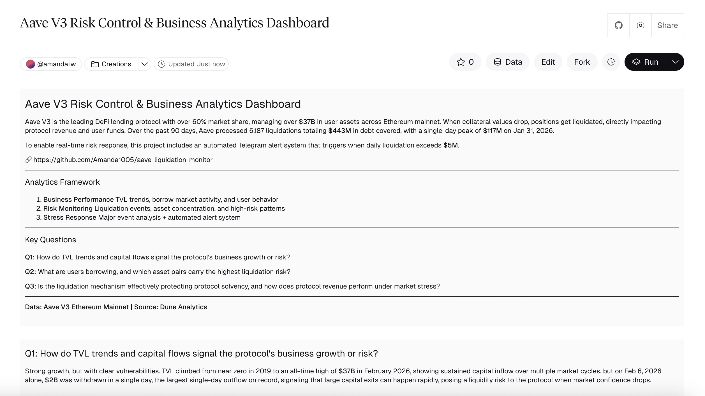
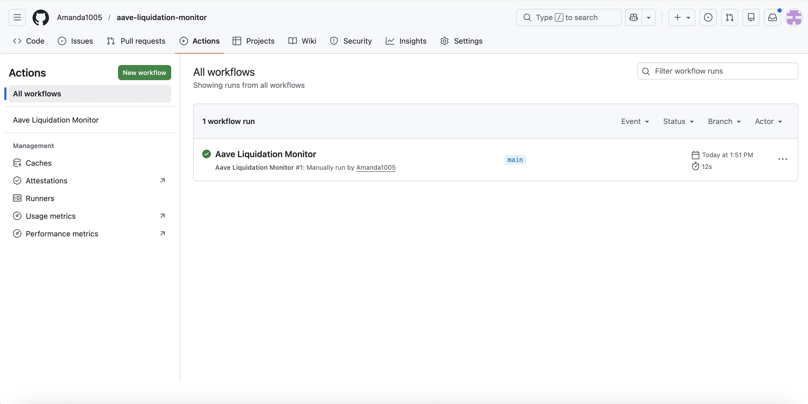
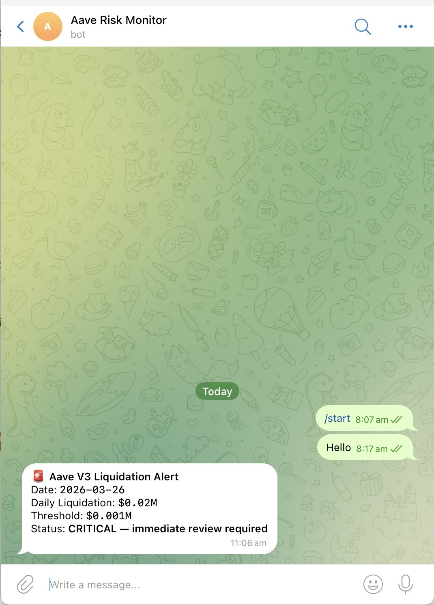

# Aave V3 Liquidation Monitor 🚨

Automated monitoring system that fetches daily liquidation data from Dune Analytics and sends a Telegram alert when liquidation volume exceeds the $5M threshold.

Part of the **Aave V3 Risk Control & Business Analytics Dashboard**, a full-stack risk analytics project built with SQL (Dune) + Python (automated monitoring).

---

## What is this?

Liquidation events are Aave's biggest income driver during market stress — but they also signal systemic risk. Over the past 90 days, Aave processed 6,187 liquidations totaling $443M, with a single-day peak of $117M on Jan 31, 2026.

This monitor:
- Pulls daily liquidation volume from a Dune Analytics query via REST API
- Compares it against a configurable threshold (default: $5M)
- Automatically sends a Telegram alert when the threshold is exceeded
- Runs every day at 09:00 UTC via GitHub Actions — no manual intervention needed

---

## Notes on Design Decisions

**Why Telegram (not email)?**
Liquidation events can escalate rapidly during market crashes. Telegram delivers instant mobile notifications, making it more suitable for real-time risk operations than email digests. The system can be extended to Slack or PagerDuty for enterprise alerting.

**Why $5M threshold?**
Based on 90 days of historical data, daily liquidation volume is near zero on most days. $5M represents a statistically significant spike that warrants immediate review.

---

## Architecture
```
Dune Analytics (Liquidation Risk Monitoring Query)
        ↓  REST API — triggered daily at 09:00 UTC
   monitor.py  ←  GitHub Actions (cron schedule)
        ↓  if daily_liquidation > $5M
   Telegram Alert (Aave Risk Monitor Bot)
```

---

## Demo

📊 Dune Dashboard — Data Source


✅ GitHub Actions — Automated Daily Run


🚨 Telegram Alert — Threshold Exceeded


---

## Features

| Feature | Detail |
|---------|--------|
| Data source | Dune Analytics API v1 |
| Detection threshold | $5M (configurable) |
| Schedule | Daily at 09:00 UTC via GitHub Actions |
| Alert channel | Telegram Bot |
| Manual trigger | GitHub Actions → Run workflow |

---

## Quick Start
```bash
# 1. Clone the repo
git clone https://github.com/Amanda1005/aave-liquidation-monitor.git
cd aave-liquidation-monitor

# 2. Install dependency
pip install requests

# 3. Set environment variables
export DUNE_API_KEY="your_dune_api_key"
export DUNE_QUERY_ID="your_query_id"
export TELEGRAM_BOT_TOKEN="your_telegram_bot_token"
export TELEGRAM_CHAT_ID="your_chat_id"
export THRESHOLD="5"

# 4. Run
python3 monitor.py
```

---

## Setup — GitHub Actions (Automated)

Go to your repo → Settings → Secrets and variables → Actions → New repository secret

| Secret | Value |
|--------|-------|
| `DUNE_API_KEY` | Dune Analytics API key |
| `DUNE_QUERY_ID` | Query ID (numbers only) |
| `TELEGRAM_BOT_TOKEN` | Telegram Bot Token |
| `TELEGRAM_CHAT_ID` | Your Telegram Chat ID |
| `THRESHOLD` | Alert threshold in millions (default: 5) |

Once secrets are set, the workflow runs automatically every day. You can also trigger it manually via Actions → Aave Liquidation Monitor → Run workflow.

---

## Tech Stack

| Layer | Tool |
|-------|------|
| Data & SQL | Dune Analytics |
| API | Dune REST API v1 |
| Language | Python 3.11 |
| HTTP client | `requests` |
| Alerting | Telegram Bot API |
| Scheduling | GitHub Actions (cron) |

---

## Related

📊 **[Dune Dashboard — Aave V3 Risk Control & Business Analytics](https://dune.com/amandatw/aave-v3-risk-control-and-business-analytics-dashboard)**